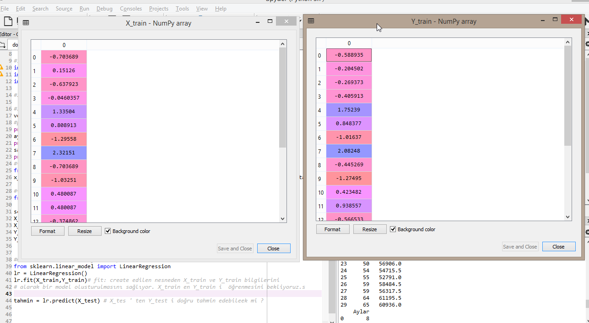
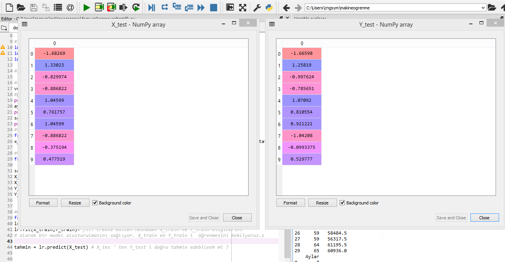
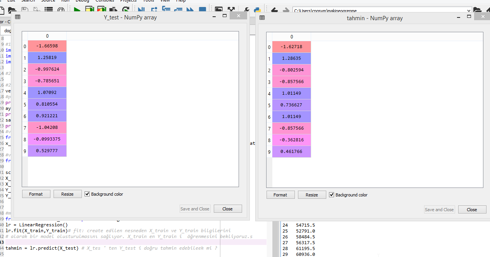
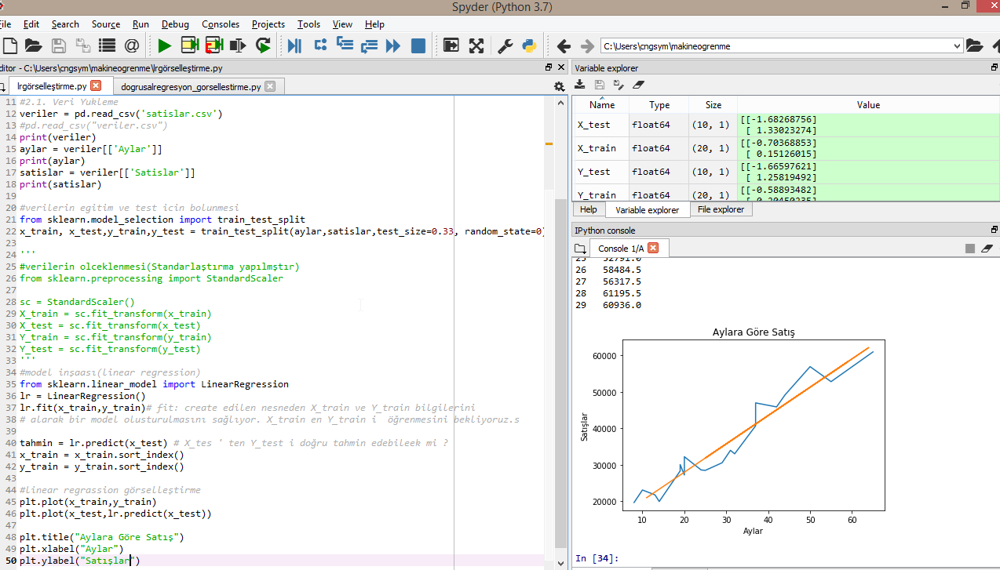

# AI-MachineLearning
Eğitim Bölümü: Train kümesinde rastgele seçilen(%66 lık kısım) herbir ay için bir satış değeri var, rastgele seçilmiş aylardan o ayların rastgele seçilmiş karşılığı olan satış değerler var. Misal 5. indexe sahip 19.ay için  yine 5. indexe sahip bir satış değeri var.  ve aylar ile satış değerleri arasında doğrusal bir bağlantı kurmaya çalışacaktır.

Test Bölümü: Daha sonrasında da öğrenmenin test süreci için verilen bir ay için satış değerinin tahmin edilmesi beklenmektedir.Misal 11. ay için doğru değer 18865.5 iken tahminin sonucu 19000 ise, bu tahmin sonucunun  kabul edilebilir olup olmadığının kontrolü yapılmaktadır.

Gerçek Y_test degerleri ve bizim predictionumuz: linear regrassion ile tahmin etmeye çalışmıştır. (tabi öncesinde bir standardizasyonu sağlamak adına Ay e Satış değerleri  Standarlaştırılmıştır. )

Doğrusal regrasyonun grafikte maximum lineerliğe ulaşmakiçindir yani aslındaamaç verilen noktalara ek yakın doğruyu çizmektir.

